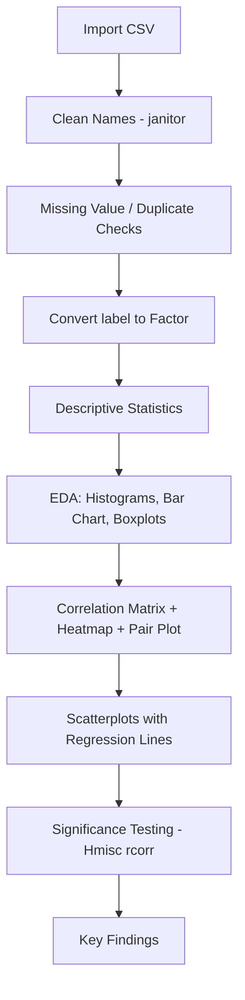

# 🌾 Statistical Analysis of Crop Recommendation Dataset using R

Exploratory and correlational statistical analysis of a 2,200-record, 22-crop agricultural dataset, built end-to-end in R.


---

## 📌 Overview

This project statistically profiles the **Crop Recommendation Dataset** — 2,200 observations across 22 balanced crop classes (100 records each), with 7 numeric soil/climate features (`n`, `p`, `k`, `temperature`, `humidity`, `ph`, `rainfall`) and 1 categorical crop label. The workflow covers data cleaning and validation, descriptive statistics, univariate and multivariate EDA, and Pearson correlation analysis with significance testing — surfacing insights relevant to soil-testing and precision-agriculture applications.

**Source:** Kaggle — Crop Recommendation Dataset · **Missing values:** 0 · **Duplicates:** 0

| Variable | Type | Description |
|---|---|---|
| `n`, `p`, `k` | Integer | Nitrogen, phosphorus, potassium in soil (kg/ha) |
| `temperature` | Numeric | Ambient temperature (°C) |
| `humidity` | Numeric | Relative humidity (%) |
| `ph` | Numeric | Soil pH |
| `rainfall` | Numeric | Rainfall (mm) |
| `label` | Factor (22 levels) | Recommended crop |

---

## 🛠️ Tools

R · tidyverse · ggplot2 · corrplot · GGally · psych · Hmisc · skimr · janitor

---

## 🔄 Workflow



---

## 📁 Project Structure

```
crop-recommendation-statistical-analysis/
├── Data/
│   └── Crop_recommendation.csv
├── Scripts/
│   └── Statistical-Analysis-with-R/
│       ├── 01_Data_Import_Cleaning.R
│       ├── 02_Descriptive_statistics.R
│       ├── 03_Exploratory_Data_Analysis.R
│       ├── 04_Correlation_Analysis.R
│       └── Statistical-Analysis-with-R.Rproj
├── Images/
│   └── *.png
├── Report/
│   └── Crop_Recommendation_Statistical_Analysis_Report.pdf
└── README.md
```

---

## 🧹 Data Cleaning

- **Missing values:** `colSums(is.na(data))` → 0 across all 8 columns
- **Duplicates:** `sum(duplicated(data))` → 0; `distinct()` applied defensively
- **Column names:** standardized via `janitor::clean_names()`
- **Type conversion:** `label` converted to `factor` (22 levels)

---

## 📈 Descriptive Statistics

| Variable | Mean | Median | Std. Dev. | Range | CV (%) |
|---|---|---|---|---|---|
| Nitrogen (n) | 50.55 | 37.00 | 36.92 | 0 – 140 | 73.03 |
| Phosphorus (p) | 53.36 | 51.00 | 32.99 | 5 – 145 | 61.81 |
| Potassium (k) | 48.15 | 32.00 | 50.65 | 5 – 205 | 105.19 |
| Temperature (°C) | 25.62 | 25.60 | 5.06 | 8.83 – 43.68 | 19.77 |
| Humidity (%) | 71.48 | 80.47 | 22.26 | 14.26 – 99.98 | 31.15 |
| Soil pH | 6.47 | 6.43 | 0.77 | 3.50 – 9.94 | 11.96 |
| Rainfall (mm) | 103.46 | 94.87 | 54.96 | 20.21 – 298.56 | 53.12 |

Soil pH is the most stable variable (lowest CV); potassium is the most variable, with its standard deviation exceeding its mean — a sign of strong right-skew.

---

## 🖼️ Visualizations

**1. Distribution of Crop Types** — `Images/crop_distribution.png`
Every one of the 22 crops has exactly 100 records — a perfectly balanced dataset with no class-imbalance concerns.

**2. Histogram of Temperature** — `Images/Histogram_of_Temperature.png`
Broadly bell-shaped, concentrated between 23–29°C, with a smaller cool-climate cluster (8–17°C) and a thin tail toward the low 40s°C.

**3. Histogram of Rainfall** — `Images/Histogram_of_Rainfall.png`
Right-skewed and multi-modal, dense between 40–130 mm with a secondary cluster near 170–200 mm and a long tail out to ~300 mm — distinct rainfall regimes across crop types.

**4. Histogram of Soil pH** — `Images/Histogram_of_pH.png`
Tight, symmetric, and bell-shaped around pH 6–7, with only a few observations at the acidic (~3.5) and alkaline (~9.9) extremes.

**5. Boxplots of Numeric Variables** — `Images/Boxplots.png`
Rainfall shows the widest spread and heaviest outlier activity; potassium has a distinct high-value outlier cluster separate from its main box; pH and temperature are comparatively tight with few outliers.

**6. Correlation Heatmap** — `Images/correlation_heatmap.png`
Only the phosphorus–potassium cell is strongly saturated (r = 0.74); every other off-diagonal cell is pale, confirming weak correlation elsewhere.

**7. Pairwise Relationships Among Numeric Variables** — `Images/Pairwise_Relationships_Among_Numeric_Variables.png`
The `ggpairs()` grid confirms the correlation matrix: p–k is the only pair with a clear, tightly-banded positive scatter (r = 0.736); every other off-diagonal panel is diffuse. The scatter panels also show a distinctly *blocky, clustered* pattern rather than a smooth cloud — nitrogen, phosphorus, and potassium each take a limited set of repeated values (visible as vertical/horizontal stripes), reflecting the 22 discrete crop-specific nutrient profiles rather than continuous variation. The diagonal density curves show potassium and rainfall as right-skewed and multi-modal (matching their histograms), humidity as bimodal with peaks near the low-20s% and high-80s%, and temperature and pH as the closest to a single symmetric peak.

**8. Temperature vs Rainfall** — `Images/Temp_vs_Rainfall.png`
Nearly flat regression line (r = -0.03); temperature is a poor linear predictor of rainfall.

**9. Temperature vs Humidity** — `Images/Temp_vs_Humidity.png`
Weak positive slope (r = 0.21), the strongest of the scatterplot relationships, but still not practically predictive alone.

**10. Soil pH vs Rainfall** — `Images/pH_vs_Rainfall.png`
Mild, statistically significant negative slope (r = -0.11); higher rainfall is weakly associated with more acidic soils.

---

## 🔑 Key Findings

- 2,200 records, 22 crop classes, each with exactly 100 observations — no missing values or duplicates.
- Soil pH is the most stable variable (CV = 11.96%); potassium is the most variable (CV = 105.19%, right-skewed).
- Rainfall and potassium are right-skewed and multi-modal; humidity is bimodal; temperature and pH are the most symmetric.
- Phosphorus and potassium are the only strongly correlated pair (**r = 0.74, p < 0.001**) — consistent with common NPK fertilizer co-application.
- All other variable pairs are weakly correlated (**|r| ≤ 0.23**), and several — n–temperature, temperature–pH, humidity–pH, temperature–rainfall — are not statistically significant (p > 0.05).
- The pair plot confirms clustered, crop-specific nutrient profiles rather than continuous joint distributions, and shows no multivariate structure beyond what the correlation matrix already captures.
- Low overall multicollinearity (aside from p–k) and a perfectly balanced target class make this dataset well suited for classification modeling with minimal feature reduction.

---

## ⚙️ Installation

1. Install R (4.0+) from [CRAN](https://cran.r-project.org/).
2. Clone the repo and open `Scripts/Statistical-Analysis-with-R/Statistical-Analysis-with-R.Rproj` in RStudio.
3. Update the file path in `01_Data_Import_Cleaning.R` to point to your local `Crop_recommendation.csv`.
4. Run the scripts in order:
   ```r
   source("Scripts/Statistical-Analysis-with-R/01_Data_Import_Cleaning.R")
   source("Scripts/Statistical-Analysis-with-R/02_Descriptive_statistics.R")
   source("Scripts/Statistical-Analysis-with-R/03_Exploratory_Data_Analysis.R")
   source("Scripts/Statistical-Analysis-with-R/04_Correlation_Analysis.R")
   ```
   Plots are saved automatically to `Images/`.

```r
install.packages(c("tidyverse", "ggplot2", "psych", "corrplot",
                    "GGally", "janitor", "skimr", "Hmisc"))
```

---

## 📊 Results

The dataset is clean, balanced, and well-structured. Soil pH is the most stable variable; potassium the most variable and right-skewed. Phosphorus and potassium are the only strongly related pair (r = 0.74); all other environmental variables are weakly correlated or statistically independent — a favorable structure for downstream classification modeling. Full statistical tables and figure-by-figure interpretation are in the [project report](Report/Crop_Recommendation_Statistical_Analysis_Report.pdf).

---

## 🚀 Future Improvements

- Supervised classification (random forest, gradient boosting, neural networks) to predict crop from environmental features
- Train/test split + cross-validation to benchmark accuracy, precision, recall, F1
- Interactive Shiny app / API for real-time crop recommendations
- Yield prediction with additional yield data
- Engineered features (e.g., N:P:K ratios) and per-crop grouped statistics

---

## 👤 Author

**[Pooja M P]** · 🔗 [poojamp0329](https://linkedin.com) · 💻 [poojamp0329](https://github.com)

---

<p align="center"><i>Built with R · Powered by data · Grown for agriculture 🌱</i></p>
